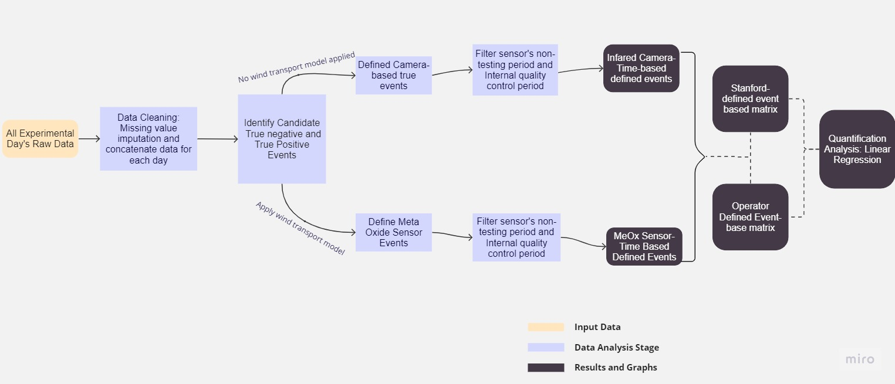

# Continuous-Monitoring-Version

## Table of Contents
- [Introduction](#introduction)
- [Installation](#installation)
- [Usage](#usage)

## Introduction
This project aims to thoroughly evaluate the performance of stationary real-time emission detection technology, specifically in detecting and quantifying methane emissions. The cornerstone of our analysis is the comprehensive comparison of sensor-reported event data against a dataset of actual emissions during Stanford Control Release Campaign in Casagrande, AZ from October to December.Our first step involves converting actual emission data into event-based data, similar to sensor reports. We incorporate factors such as wind speed and direction into our calculations using a wind transpose model. This ensures our event data reflects real-world conditions and allows for a more precise comparison.
Our analysis consists of three key parts: Detection Analysis, Quantification Analysis, and Sensitivity Analysis.

In the Detection Analysis phase, we construct confusion matrices for both Stanford Defined Scenarios and Operator Defined Scenarios. This process helps evaluate the system's performance in accurately identifying true events. In addition, we generate time-based confusion matrices, offering a temporal perspective on each team's performance in detecting methane leaks.

The Quantification Analysis focuses on the accuracy of emission volume estimates reported by the sensors. We employ a linear regression model to draw a comparison between the methane quantities reported by sensors and actual emission volumes. This approach enables us to measure the sensors' precision in estimating the volume of methane emissions.

Finally, in the Sensitivity Analysis, we assess the robustness of our evaluation process. We evaluate the parameters used in our calculations, such as the Wind Transport Radius and the Internal Filtering Length, to ensure they don't unduly influence the evaluation results. This step safeguards the validity and reliability of our findings.

Collectively, these analyses provide an in-depth evaluation of the detection technology's efficiency in real-time methane emission detection and quantification.

The structure of this project is as follows:
```
.
├── README.md
├── assets
│   ├── README.md
│   ├── Raw_Data_Per_Day
│   ├── all_wind_data
│   ├── events_PN
│   ├── sensor_data
│   └── sensor_raw_data
├── requirements.txt
├── results
│   ├── 03_DetectionAnalysis
│   ├── 04_QuantificationAnalysis
│   └── 05_SensitivityAnalysis
└── src
    ├── 01_Preprocessing
    ├── 02_FilterEvent
    ├── 03_DetectionAnalysis
    ├── 04_QuantificationAnalysis
    └── 05_SensitivityAnalysis
```
- The README.md file is the primary project documentation, providing an overview of the project's framework.
- The assets directory stores the project's asset files, including original data and intermediate results used for calculations. For more detailed information, please refer to [assets/README.md](./assets/README.md).
- The requirements.txt file lists the necessary dependencies for running the project.
- The results directory contains the project's outcomes at each stage. For additional insights, please see [results/README.md](./results/README.md).
- The src directory holds the project's source code, which includes modules for data preprocessing, event filtering, detection analysis, quantification analysis, and sensitivity analysis. For specific details, please refer to [src/README.md](./src/README.md).

## Installation
This project was developed using Python 3. Ensure that you have Python 3 installed on your system. After installation, you can install the necessary dependencies for the project by running the following command:
```bash
pip install -r requirements.txt
```

## Usage
The project's code is available in the form of `.ipynb` notebooks. To launch and use this project, execute the following command in this directory:
```bash
jupyter notebook --notebook-dir=./ --token=''
```
This will open a web page in your default browser, allowing you to access and run the project's source code.
