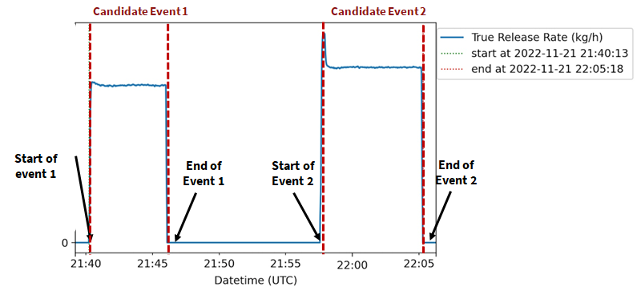
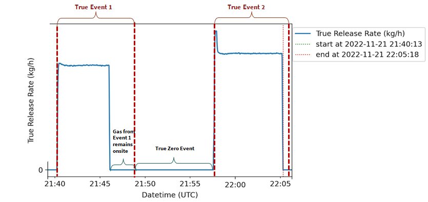

In Filter Event module, the focus is on detecting all true events using the wind transpose model. The process involves two steps:

**Step 1: Finding all candidate events**
1. Identify 0 segments, which are the longest time periods where the release rate is 0.
   - Condition: The release rate in the second before the start time of the segment is greater than 0, and the dose in the second after the end time of the segment is greater than 0, the release rate is 0 between start time and end time.
   - The start time and end time of the segment must be on the same date.
2. Based on the 0 segments, identify candidate events. A candidate event is defined as an event occurring between two consecutive 0 segments in time.

**Step 2: Finding all true events**
1. Determine the experiment_area_radius, representing the maximum extent from the release point to the experimental boundaries.
2. Retrieve wind velocity data (u_east and u_north components) from October 10, 2022, to November 30, 2022.
3. Determine the start time and end time of all true events. The start time of the true event is the start time of the corresponding candidate event, and the end time is the earliest time when all methane gas has left the observation area. For example, The end of Event 1 and Event 2 are both the earliest time when gas is fully out of the observation area, the observation area is set us the 2x of the entire experimental parameter.

**Inputs:**
- threshold: Distance parameter used by the wind transpose model (values: 1, 2 or 4, indicating 1x, 2x or 4x the experimental area radius).

**Data:**
- True release data generated by the [01_Preprocessing](../01_Preprocessing/) phase (located in the raw release dose data directory).
- Wind data (u_east and u_north components) available in the [all_wind_data](../../assets/all_wind_data/).

**Outputs:**
- Positive and negative candidate events before applying the wind transpose model stored in "candidate_event_[P/N/D].csv" files (in the [events_PN](../../assets/events_PN/) directory).
- True events calculated by the wind transpose model using different threshold values stored in "true_event_threshold=[1/2/4]xradius_[P/N/D].csv" files (in the [events_PN](../../assets/events_PN/) directory). The [1/2/4]xradius represents the threshold value as a multiple of the radius of the experimental area, and [P/N/D] indicates positive or negative or deleted events.