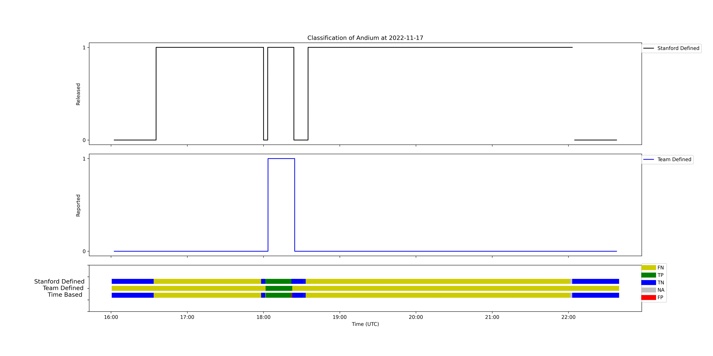

In this phase, we conduct an analysis and construct confusion matrices for both Stanford Defined Scenarios and Operator Defined Scenarios to evaluate the system's ability to accurately identify true events. Additionally, we generate time-based confusion matrices to gain insights into each team's performance in detecting methane leaks over time. The analysis in this stage focuses on four key aspects:

- Time-based Confusion Matrix: Process of comparing ground truth data withreported data on a second-by-second basis

    

- Stanford Defined Confusion Matrix: The accuracy of the Operator's prediction when a Stanford Defined Event occurs.
    

- Team Defined Confusion Matrix: The accuracy of the match between an Operator Defined Event and a Stanford Defined Event when it occurs.

    

For the case of Stanford Defined Confusion Matrix and Team Defined Confusion Matrix, we need to filter out certain events: 
- filtering Based on Unofficial and Official Test Times:
    - Unofficial Test Time: This can be found in the Data from Daily Testing Cycle File. detailing the start (s1) and end times (e1) of each day's official test time, and the end time (e1) could extend into the next day.
    - Official Test Time: This can be directly retrieved from Daily Testing Cycle File, detailing the start (s2) and end times (e2) of each day's official test time.
    - For the unofficial (s1, e1) and official (s2, e2) test times, the times from s1 to s2 and e1 to e2 are set to NA and cannot be filled. This indicates they need to be filtered out in subsequent computations.
- Duration-Based Filtering: True Events with durations less than a certain threshold (60s) will be filtered out.
- Report-Based Filtering: Report Events from each team listed in the Missing Report Date will be filtered out.
- Date-Based Filtering: True Events and Report Events from specific dates (2022-10-18/19/20/21/22) will be filtered out.

## Time-based Confusion Matrix

The primary focus of this analysis is on the evaluation of Confusion Matrix metrics, including FPR(%), TNR(%), FNR(%), NPV(%), FDR(%), accuracy(%), precision(%), recall(%), f1(%), and f2(%). These metrics are computed based on time-based sequential data derived from the combination of true release data and reported event data.

### Inputs

- **Threshold**: Represents the distance parameter used by the wind transpose model (1/2/4 times the experimental area radius).
- **Ignore Duration**: Denotes the minimum event length in Stanford Defined Events that should be disregarded (30/60/120 seconds).
- **Short Stack**: Indicates whether to analyze results only for the short stack (0 for analyzing all experimental dates, 1 for analyzing only the short stack scenario).
- **Overlap**: Indicates whether to consider only the time when events reported by all sensors overlap (0 for no, 1 for yes).

### Data

The main components of the analysis consist of the true event data and the reported event data.

### Output

The resulting Confusion Matrix metrics under different input parameters are saved in the [Time-based ConfusionMatrix](../../results/03_DetectionAnalysis/Time-based%20ConfusionMatrix/) directory.

## Stanford Defined Confusion Matrix

This analysis focuses on computing the Detection Rate (%)  and Non-Emission Accuracy (%) based on Stanford Defined Events, considering different input parameters.

The classification rules of stanford defined events as shown in the table below.
| Stanford Defined Event | Matched Team Defined Events | Classification |
| :-: | :-: | :-: |
| Positive | overlap >=10% with all Positive Event | TP |
| Positive | overlap >90% with all Negative Event | FN |
| Negative | overlap >=10% with all Positive Event | FP |
| Negative | overlap >90% with all Negative Event | TN |

### Inputs

- **Threshold**: Represents the distance parameter used by the wind transpose model (1/2/4 times the experimental area radius).
- **Ignore Duration**: Denotes the minimum event length in Stanford Defined Events that should be ignored (30/60/120 seconds).
- **Short Stack**: Indicates whether to analyze results only for the short stack (0 for analyzing all experimental dates, 1 for analyzing only the short stack scenario).

### Data

The main components of the analysis consist of the true event data and the reported event data.

### Outputs

Based on different input parameters, a sets of metrics, namely Reliability of Identifications (%) and Reliability of Non-Emission Identifications (%), are computed. These metrics provide valuable insights into the Event-based Confusion Matrix for Stanford Defined Events. The results are saved in the [Stanford Defined Events_Reliability](../../results/03_DetectionAnalysis/Event-based%20ConfusionMatrix/Stanford%20Defined%20Events_Reliability/) directory.

## Team Defined Confusion Matrix

This analysis aims to compute the Detection Rate (%) and Non-Emission Accuracy (%) based on Stanford Defined Events based on Team Defined Events, considering different input parameters.

The classification rules of team defined events as shown as blow.
| Team Defined Event | Matched Stanford Defined Events | Classification |
| :-: | :-: | :-: |
| Positive | overlap >=10% with all Positive Event | TP |
| Positive | overlap >90% with all Negative Event | FP |
| Negative | overlap >=10% with all Positive Event | FN |
| Negative | overlap >90% with all Negative Event | TN |

### Inputs

- **Threshold**: Represents the distance parameter used by the wind transpose model (1/2/4 times the experimental area radius).
- **Ignore Duration**: Denotes the minimum event length in Stanford Defined Events that should be ignored (30/60/120 seconds).
- **Short Stack**: Indicates whether to analyze results only for the short stack (0 for analyzing all experimental dates, 1 for analyzing only the short stack scenario).

### Data

The main components of the analysis consist of the true event data and the reported event data.

### Outputs

Based on different input parameters, a sets of metrics, namely TPR/precision/TNR/NPV, are computed. These metrics provide insights into the Event-based Confusion
Matrix for Team Defined Events. The results are saved in the [Team Defined Events_Reliability](../../results/03_DetectionAnalysis/Event-based%20ConfusionMatrix/Team%20Defined%20Events_Reliability/) directory.

## Match plots

In addition to the analysis conducted, a test case was performed to validate the accuracy of the results. The intermediate results of the Stanford Defined Confusion Matrix and Team Defined Confusion Matrix, including the matching relationship between Stanford Defined Events and Team Defined Events, were saved. These results were then used to generate daily event matching and event classification graphs.

### Inputs

- **Threshold**: Represents the distance parameter used by the wind transpose model (1/2/4 times the experimental area radius).
- **Ignore Duration**: Denotes the minimum event length in Stanford Defined Events that should be ignored (30/60/120 seconds).
- **Short Stack**: Indicates whether to analyze results only for the short stack (0 for analyzing all experimental dates, 1 for analyzing only the short stack scenario).

### Data

The matching relationship between Stanford Defined Events and Team Defined Events.

### Output

Daily event matching and event classification graphs are saved in the [Matching Figures Per Day](../../results/03_DetectionAnalysis/Test-case%20Matching%20Data/Matching%20Figures%20Per%20Day/) directory, providing visual representations of the matching and classification performance on a daily basis.

### Example

The following is the matching graph of Andium sensors on October 17, 2022, based on a 2x experimental radius and a minimum event duration of 60 seconds.

From the graph, it can be observed that the image is divided into three regions from top to bottom, which are Stanford Defined Events, Team Defined Events, and Classification of Events, respectively.
- Stanford Defined Events: In the calculation process of the Stanford Defined Confusion Matrix, the Stanford Defined Events used are represented in the graph as follows: If a Stanford Defined Event is considered positive, its value on the graph is 1; otherwise, it is represented as 0.
- Team Defined Events: In the calculation process of the Team Defined Confusion Matrix, the Team Defined Events used are represented in the graph as follows: If a Team Defined Event is considered positive, its value on the graph is 1; otherwise, it is represented as 0.
- Classification of Events: This section consists of three bar charts from top to bottom. The first one represents the classification of Stanford Defined Events, the second one represents the classification of Team Defined Events, and the third one represents the classification of Time-based Events. They are represented by five colors: green for 'TP' (True Positive), blue for 'TN' (True Negative), yellow for 'FN' (False Negative), red for 'FP' (False Positive), and gray for events that have been filtered out and not included in the Confusion Matrix calculation.